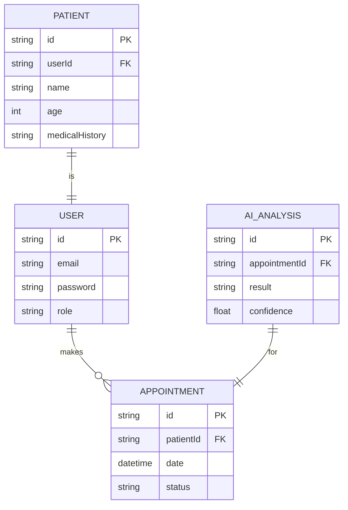

# MediAI - Full-Stack Medical AI Project

## Overview
MediAI is a full-stack platform that leverages AI to provide medical insights and analysis.

## Project Structure
- `backend/`: Node.js + Express API
- `ai-service/`: Python + FastAPI AI Service
- `frontend/`: React + Vite + Tailwind CSS UI

## ERD Diagram Sketch


## Setup Instructions

### 1. Root Dependencies
```bash
npm install
```

### 2. Backend Setup
```bash
cd backend
npm install
cp .env.example .env
npm run dev
```

### 3. AI Service Setup
```bash
cd ai-service
python -m venv venv
# Windows (Command Prompt)
venv\Scripts\activate
# Windows (Git Bash / WSL)
source venv/Scripts/activate
# Linux/Mac
source venv/bin/activate
pip install -r requirements.txt
cp .env.example .env
uvicorn main:app --reload
```

### 4. Frontend Setup
```bash
cd frontend
npm install
npm run dev
```

## API Health Checks
- Backend: `GET /api/health`
- AI Service: `GET /health`
